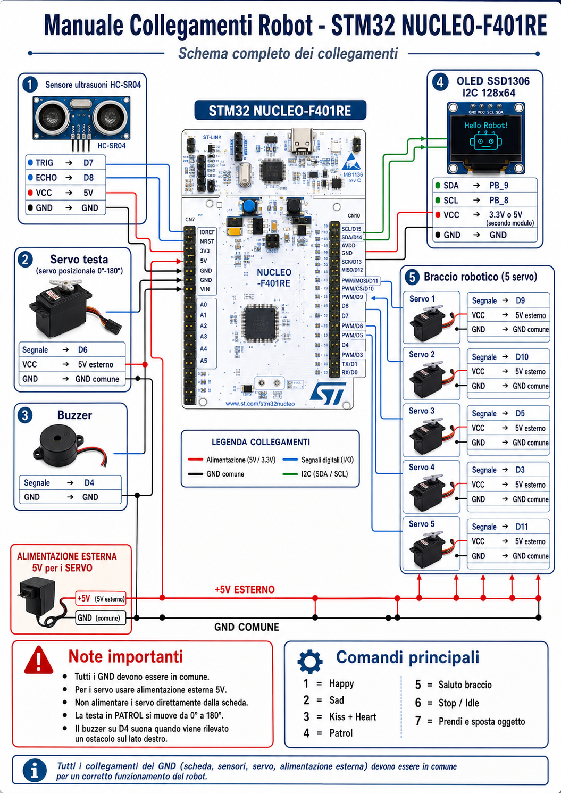

# uEgenio

Progetto robotico **uEgenio** con controllo vocale in italiano, pipeline AI locale (Whisper + Ollama) e firmware STM32/mbed per movimenti, sensori e animazioni.

## Panoramica

Il repository contiene due parti principali:

- **Controller Python (`AiMoods.py`)**: ascolta audio dal microfono, trascrive la frase, interpreta i comandi e li invia via seriale alla scheda STM32.
- **Firmware embedded (`Progetto1.0/uEgenio`)**: esegue i comandi ricevuti (espressioni OLED, modalità patrol, saluto braccio, pick & place), integra sensore HC-SR04 e gestione servo.

## Struttura cartelle

- `README.md` → documentazione del progetto.
- `Manuale.png` → manuale visuale del progetto.
- `Progetto1.0/`
  - `AiMoods.py` → controller vocale/AI lato PC.
  - `requirements.txt` → dipendenze Python.
  - `setup.bat` → setup rapido ambiente Windows (pip, FFmpeg, modello Ollama).
  - `uEgenio/`
    - `main.cpp` → logica firmware principale STM32.
    - `HCSR04.cpp` + `include/HCSR04.h` → driver ultrasonico HC-SR04.
    - `mbed_app.json` → configurazione mbed.
    - `mbed-os.lib` → riferimento libreria mbed-os.

## Manuale (immagine)



## Flusso operativo

1. Il PC registra audio dal microfono.
2. Whisper trascrive la frase in italiano.
3. Regole euristiche + LLM (Ollama `qwen3:4b`) convertono la frase in sequenze comando (`0..7`).
4. I comandi vengono inviati su seriale (`115200`) alla STM32.
5. Il firmware aggiorna modalità e attuatori (testa, braccio, OLED, buzzer, patrol).

## Mappa comandi seriali

- `0` = nessuna azione
- `1` = reazione positiva al robot
- `2` = reazione negativa
- `3` = animazione “preside”
- `4` = patrol mode
- `5` = saluto continuo col braccio
- `6` = stop/ritorno IDLE
- `7` = sequenza pick-and-place

## Setup rapido (Windows)

```bat
setup.bat
```

In alternativa manuale:

```bat
python -m pip install --upgrade pip
pip install -r requirements.txt
winget install Gyan.FFmpeg
ollama pull qwen3:4b
```

## Avvio controller Python

1. Verificare porta seriale in `SERIAL_PORT` (default `COM5`) dentro `AiMoods.py`.
2. Avviare lo script:

```bat
python AiMoods.py
```

